# Database Schema — Revised

This document supersedes [`schema.md`](./schema.md). It folds in the KPI scoring model from the previous revision **and** resolves the 10 structural gaps identified during review:

1. No identity/auth surface
2. No history for goal/KPI progress
3. No goal/review discussion threads
4. No template version control
5. `users.department_id` is mutable, breaking historical reports
6. `performance_cycles` lacks a timezone
7. No peer / 360 review support
8. No explicit cycle participant list
9. `audit_logs` will not scale without partitioning
10. `goals.weight = 100` invariant enforced only at app layer

Naming change: `job_function` is renamed `job_category` everywhere.

---

## Table of Contents

- [Overview](#overview)
- [Design Decisions](#design-decisions)
- [Entity Relationship Summary](#entity-relationship-summary)
- [Tables](#tables)
  - [Identity & Org](#identity--org)
    - [users](#users)
    - [user_identities](#user_identities)
    - [user_department_history](#user_department_history)
    - [roles](#roles)
    - [user_roles](#user_roles)
    - [departments](#departments)
  - [Cycles & Templates](#cycles--templates)
    - [performance_cycles](#performance_cycles)
    - [cycle_participants](#cycle_participants)
    - [evaluation_templates](#evaluation_templates)
    - [template_versions](#template_versions)
    - [template_questions](#template_questions)
    - [cycle_template_assignments](#cycle_template_assignments)
  - [Goals & KPIs](#goals--kpis)
    - [goals](#goals)
    - [goal_progress_updates](#goal_progress_updates)
    - [goal_comments](#goal_comments)
    - [kpis](#kpis)
    - [kpi_assignments](#kpi_assignments)
    - [kpi_progress_snapshots](#kpi_progress_snapshots)
  - [Reviews & Appeals](#reviews--appeals)
    - [performance_reviews](#performance_reviews)
    - [review_participants](#review_participants)
    - [review_responses](#review_responses)
    - [review_comments](#review_comments)
    - [review_documents](#review_documents)
    - [appeals](#appeals)
    - [appeal_responses](#appeal_responses)
  - [Cross-cutting](#cross-cutting)
    - [notifications](#notifications)
    - [audit_logs](#audit_logs)
    - [security_violation_logs](#security_violation_logs)
- [Enums](#enums)
- [Constraints & Triggers](#constraints--triggers)
- [Indexes & Partitioning](#indexes--partitioning)
- [Scoring Model](#scoring-model)
- [Design Notes](#design-notes)

---

## Overview

Centralized enterprise Performance Management System serving **Employees**, **Managers**, and **HR**, designed for ~100,000 users across multiple time zones. Domains:

| Domain | Description |
|---|---|
| **Identity & Org** | Users, IdP linkage, RBAC, organizational hierarchy with history |
| **Cycles & Templates** | Versioned templates assigned to cycles by job category |
| **Goal & KPI Management** | SMART goals & KPIs with progress history and threaded discussion |
| **Performance Review** | Self / Manager / Peer / Direct-report evaluation with computed scores |
| **Appeals** | Formal challenge of finalized reviews |
| **Compliance & Audit** | Append-only audit logs (partitioned), violation logging |
| **Notifications** | Multi-channel system alerts |

---

## Design Decisions

| # | Issue | Resolution |
|---|---|---|
| 1 | Auth not yet selected | Introduce [`user_identities`](#user_identities) as a forward-looking placeholder. The application can authenticate via any IdP (e.g. Google OAuth) and resolve to a `users` row through this table without further schema changes. |
| 2 | Progress not historized | Add [`goal_progress_updates`](#goal_progress_updates) and [`kpi_progress_snapshots`](#kpi_progress_snapshots). The "current value" columns become caches of the latest entry. |
| 3 | No discussion | Add [`goal_comments`](#goal_comments) and [`review_comments`](#review_comments) with thread support via `parent_comment_id`. |
| 4 | Template editing breaks history | Introduce [`template_versions`](#template_versions). Questions belong to a version, not the template. Reviews reference the exact version they were rendered from. Editing a published template creates a new version. |
| 5 | Department mobility loses reporting fidelity | Add [`user_department_history`](#user_department_history) **and** snapshot `department_id_snapshot` on [`performance_reviews`](#performance_reviews) at creation. Dashboards read from the snapshot; HR can audit moves via the history table. |
| 6 | Cycle deadlines ambiguous globally | Add `timezone` (IANA TZ identifier) on [`performance_cycles`](#performance_cycles). Deadlines are interpreted in that zone. |
| 7 | 360 review missing | Expand [`respondent_type_enum`](#enums) (`self`, `manager`, `peer`, `direct_report`, `hr`, `co_manager`) and add [`review_participants`](#review_participants) to invite & track non-manager evaluators. |
| 8 | Cycle scope implicit | Add [`cycle_participants`](#cycle_participants) as the authoritative list of employees in a cycle, decoupled from whether a review row exists yet. |
| 9 | Audit log scale | Declare [`audit_logs`](#audit_logs) as a **range-partitioned** table on `occurred_at` (monthly partitions). |
| 10 | Weight invariant fragile | Enforce `Σ goals.weight = 100` and `Σ kpis.weight = 100` per `(cycle_id, owner_id)` via deferrable PostgreSQL triggers. See [Constraints & Triggers](#constraints--triggers). |

---

## Entity Relationship Summary

```mermaid
erDiagram
    users ||--o{ user_identities         : "external ids"
    users ||--o{ user_roles              : "has"
    roles ||--o{ user_roles              : "assigned via"
    users ||--o{ user_department_history : "moves through"
    departments ||--o{ users             : "currently in"
    departments ||--o{ user_department_history : "tracks"

    performance_cycles ||--o{ cycle_participants         : "scopes"
    users              ||--o{ cycle_participants         : "is in"
    performance_cycles ||--o{ cycle_template_assignments : "configures"
    evaluation_templates ||--o{ template_versions        : "has versions"
    template_versions ||--o{ template_questions          : "contains"
    template_versions ||--o{ cycle_template_assignments  : "pinned by"

    performance_cycles ||--o{ goals : "contains"
    users              ||--o{ goals : "owns"
    goals              ||--o{ goal_progress_updates : "tracked by"
    goals              ||--o{ goal_comments         : "discussed in"

    performance_cycles ||--o{ kpis              : "contains"
    kpis               ||--o{ kpi_assignments    : "assigned via"
    users              ||--o{ kpi_assignments    : "responsible for"
    kpi_assignments    ||--o{ kpi_progress_snapshots : "tracked by"

    performance_cycles  ||--o{ performance_reviews : "contains"
    users               ||--o{ performance_reviews : "evaluated in"
    template_versions   ||--o{ performance_reviews : "rendered from"
    performance_reviews ||--o{ review_participants : "invites"
    users               ||--o{ review_participants : "evaluates as"
    performance_reviews ||--o{ review_responses    : "has responses"
    template_questions  ||--o{ review_responses    : "answered in"
    performance_reviews ||--o{ review_comments     : "discussed in"
    performance_reviews ||--o{ review_documents    : "evidenced by"

    performance_reviews ||--o{ appeals          : "appealed via"
    appeals             ||--o{ appeal_responses : "has replies"

    users ||--o{ notifications        : "receives"
    users ||--o{ audit_logs           : "generates"
    users ||--o{ security_violation_logs : "attempts"
```



---

## Tables

### Identity & Org

#### `users`

System users (employees, managers, HR, admins). Identity resolution from external IdPs happens via [`user_identities`](#user_identities).

| Column | Type | Constraints | Description |
|---|---|---|---|
| `id` | `UUID` | `PK, NOT NULL, DEFAULT gen_random_uuid()` | |
| `employee_id` | `VARCHAR(64)` | `UNIQUE, NOT NULL` | Company-issued employee ID |
| `email` | `VARCHAR(255)` | `UNIQUE, NOT NULL` | Corporate email (canonical, maintained by HR) |
| `full_name` | `VARCHAR(255)` | `NOT NULL` | Display name |
| `department_id` | `UUID` | `FK → departments.id, NOT NULL` | **Current** department; history in [`user_department_history`](#user_department_history) |
| `manager_id` | `UUID` | `FK → users.id, NULLABLE` | Current direct manager |
| `job_title` | `VARCHAR(128)` | `NOT NULL` | Free-text title (e.g. "Senior Software Engineer") |
| `job_category` | `VARCHAR(64)` | `NOT NULL` | e.g. `engineering`, `sales`, `hr`. Drives template assignment |
| `employment_status` | `employment_status_enum` | `NOT NULL, DEFAULT 'active'` | |
| `mfa_enabled` | `BOOLEAN` | `NOT NULL, DEFAULT false` | Mirrored from IdP `amr` claim |
| `locale` | `VARCHAR(10)` | `NOT NULL, DEFAULT 'zh-TW'` | BCP 47 |
| `timezone` | `VARCHAR(64)` | `NOT NULL, DEFAULT 'Asia/Taipei'` | IANA TZ for personalized display |
| `created_at` | `TIMESTAMPTZ` | `NOT NULL, DEFAULT now()` | |
| `updated_at` | `TIMESTAMPTZ` | `NOT NULL, DEFAULT now()` | |
| `terminated_at` | `TIMESTAMPTZ` | `NULLABLE` | Soft-termination |

---

#### `user_identities`

Maps external identity-provider subjects (e.g. Google OIDC `sub`) to internal users. Forward-looking placeholder; multiple rows per user supported for future SSO migrations.

| Column | Type | Constraints | Description |
|---|---|---|---|
| `id` | `UUID` | `PK, NOT NULL, DEFAULT gen_random_uuid()` | |
| `user_id` | `UUID` | `FK → users.id, NOT NULL` | |
| `provider` | `identity_provider_enum` | `NOT NULL` | `google`, `azure_ad`, `okta`, `local` |
| `provider_subject` | `VARCHAR(255)` | `NOT NULL` | Immutable IdP subject (e.g. Google `sub`) |
| `provider_email` | `VARCHAR(255)` | `NULLABLE` | Email reported by IdP at link time (informational; not used for resolution) |
| `linked_at` | `TIMESTAMPTZ` | `NOT NULL, DEFAULT now()` | |
| `last_login_at` | `TIMESTAMPTZ` | `NULLABLE` | |

**Unique:** `(provider, provider_subject)`. A user may have multiple providers; one provider may only resolve to one user.

> **Resolution rule:** Login lookups always join on `(provider, provider_subject)`. If no row exists, the application falls back to matching `users.email` to the IdP-asserted email — **only when** the IdP is the corporate domain — and JIT-creates the `user_identities` row on first successful login. The `users` row itself is never created via login; it must be provisioned by HR.

---

#### `user_department_history`

Append-only record of department membership over time. Powers historical reporting that does not break when an employee transfers mid-cycle.

| Column | Type | Constraints | Description |
|---|---|---|---|
| `id` | `BIGSERIAL` | `PK, NOT NULL` | |
| `user_id` | `UUID` | `FK → users.id, NOT NULL` | |
| `department_id` | `UUID` | `FK → departments.id, NOT NULL` | |
| `effective_from` | `TIMESTAMPTZ` | `NOT NULL` | Start of this membership |
| `effective_to` | `TIMESTAMPTZ` | `NULLABLE` | NULL = currently in this department |
| `recorded_by` | `UUID` | `FK → users.id, NOT NULL` | HR who recorded the change |
| `recorded_at` | `TIMESTAMPTZ` | `NOT NULL, DEFAULT now()` | |

**Invariant:** for each `user_id`, at most one row has `effective_to IS NULL`. A transfer closes the current row by setting `effective_to = now()` and inserts a new open row. Enforced by the application; verifiable by a partial unique index.

---

#### `roles`

| Column | Type | Constraints | Description |
|---|---|---|---|
| `id` | `UUID` | `PK, NOT NULL, DEFAULT gen_random_uuid()` | |
| `name` | `VARCHAR(64)` | `UNIQUE, NOT NULL` | `employee`, `manager`, `hr`, `admin` |
| `description` | `TEXT` | `NULLABLE` | |

---

#### `user_roles`

| Column | Type | Constraints | Description |
|---|---|---|---|
| `user_id` | `UUID` | `FK → users.id, NOT NULL` | |
| `role_id` | `UUID` | `FK → roles.id, NOT NULL` | |
| `granted_at` | `TIMESTAMPTZ` | `NOT NULL, DEFAULT now()` | |
| `granted_by` | `UUID` | `FK → users.id, NOT NULL` | |

**Primary Key:** `(user_id, role_id)`

---

#### `departments`

Tree-structured organizational units. A department is never hard-deleted; instead, `closed_at` marks it as retired while preserving historical references from snapshots and audit logs.

| Column | Type | Constraints | Description |
|---|---|---|---|
| `id` | `UUID` | `PK, NOT NULL, DEFAULT gen_random_uuid()` | |
| `name` | `VARCHAR(128)` | `NOT NULL` | |
| `parent_id` | `UUID` | `FK → departments.id, NULLABLE` | NULL = root; tree must be acyclic (enforced at app layer) |
| `closed_at` | `TIMESTAMPTZ` | `NULLABLE` | NULL = active; non-NULL = department retired |
| `closed_by` | `UUID` | `FK → users.id, NULLABLE` | HR who closed the department |
| `created_at` | `TIMESTAMPTZ` | `NOT NULL, DEFAULT now()` | |

> See [Department lifecycle](#department-lifecycle) for closure rules and history preservation.

---

### Cycles & Templates

#### `performance_cycles`

| Column | Type | Constraints | Description |
|---|---|---|---|
| `id` | `UUID` | `PK, NOT NULL, DEFAULT gen_random_uuid()` | |
| `name` | `VARCHAR(128)` | `NOT NULL` | e.g. `2025 Q4 Quarterly Review` |
| `cycle_type` | `cycle_type_enum` | `NOT NULL` | |
| `status` | `cycle_status_enum` | `NOT NULL, DEFAULT 'draft'` | |
| `timezone` | `VARCHAR(64)` | `NOT NULL, DEFAULT 'Asia/Taipei'` | IANA TZ. All deadlines below are interpreted in this zone |
| `self_eval_start` | `TIMESTAMPTZ` | `NOT NULL` | |
| `self_eval_end` | `TIMESTAMPTZ` | `NOT NULL` | |
| `manager_eval_start` | `TIMESTAMPTZ` | `NOT NULL` | |
| `manager_eval_end` | `TIMESTAMPTZ` | `NOT NULL` | |
| `peer_eval_start` | `TIMESTAMPTZ` | `NULLABLE` | NULL = 360 phase disabled |
| `peer_eval_end` | `TIMESTAMPTZ` | `NULLABLE` | |
| `hr_review_end` | `TIMESTAMPTZ` | `NOT NULL` | |
| `results_published_at` | `TIMESTAMPTZ` | `NULLABLE` | |
| `appeal_deadline_days` | `INTEGER` | `NOT NULL, DEFAULT 7` | |
| `is_locked` | `BOOLEAN` | `NOT NULL, DEFAULT false` | |
| `created_by` | `UUID` | `FK → users.id, NOT NULL` | |
| `created_at` | `TIMESTAMPTZ` | `NOT NULL, DEFAULT now()` | |
| `updated_at` | `TIMESTAMPTZ` | `NOT NULL, DEFAULT now()` | |

> Timestamps remain `TIMESTAMPTZ` (always stored as UTC). The `timezone` column tells the UI which wall-clock day a deadline ends on, so "midnight on the 30th" is unambiguous for a global org.

---

#### `cycle_participants`

Explicit list of who is in a cycle. Decouples cycle scope definition from whether a review row has been created yet, and supports excluding employees (e.g. on leave) deliberately.

| Column | Type | Constraints | Description |
|---|---|---|---|
| `id` | `UUID` | `PK, NOT NULL, DEFAULT gen_random_uuid()` | |
| `cycle_id` | `UUID` | `FK → performance_cycles.id, NOT NULL` | |
| `user_id` | `UUID` | `FK → users.id, NOT NULL` | |
| `included` | `BOOLEAN` | `NOT NULL, DEFAULT true` | False = explicitly excluded with reason |
| `excluded_reason` | `TEXT` | `NULLABLE` | e.g. "on parental leave", "joined after cutoff" |
| `added_by` | `UUID` | `FK → users.id, NOT NULL` | |
| `added_at` | `TIMESTAMPTZ` | `NOT NULL, DEFAULT now()` | |

**Unique:** `(cycle_id, user_id)`

---

#### `evaluation_templates`

Logical template identity. Concrete question content lives in [`template_versions`](#template_versions).

| Column | Type | Constraints | Description |
|---|---|---|---|
| `id` | `UUID` | `PK, NOT NULL, DEFAULT gen_random_uuid()` | |
| `name` | `VARCHAR(128)` | `NOT NULL` | |
| `description` | `TEXT` | `NULLABLE` | |
| `job_category` | `VARCHAR(64)` | `NULLABLE` | If set, restricts which job categories can use this template |
| `is_active` | `BOOLEAN` | `NOT NULL, DEFAULT true` | Soft delete |
| `created_by` | `UUID` | `FK → users.id, NOT NULL` | |
| `created_at` | `TIMESTAMPTZ` | `NOT NULL, DEFAULT now()` | |
| `updated_at` | `TIMESTAMPTZ` | `NOT NULL, DEFAULT now()` | |

---

#### `template_versions`

Immutable snapshot of a template's question set. Editing a template always creates a new version; existing reviews remain pinned to the version they were rendered from.

| Column | Type | Constraints | Description |
|---|---|---|---|
| `id` | `UUID` | `PK, NOT NULL, DEFAULT gen_random_uuid()` | |
| `template_id` | `UUID` | `FK → evaluation_templates.id, NOT NULL` | |
| `version_number` | `INTEGER` | `NOT NULL` | Monotonically increasing per template, starts at 1 |
| `is_current` | `BOOLEAN` | `NOT NULL, DEFAULT false` | Exactly one current version per template |
| `published_at` | `TIMESTAMPTZ` | `NULLABLE` | Set when version is first assigned to a cycle |
| `created_by` | `UUID` | `FK → users.id, NOT NULL` | |
| `created_at` | `TIMESTAMPTZ` | `NOT NULL, DEFAULT now()` | |

**Unique:** `(template_id, version_number)`. Partial unique index on `(template_id) WHERE is_current` enforces single current version.

> Once a version is referenced by any [`cycle_template_assignments`](#cycle_template_assignments) row, its `template_questions` rows become immutable. Edits create a new version.

---

#### `template_questions`

Questions belong to a `template_version`, not directly to a template.

| Column | Type | Constraints | Description |
|---|---|---|---|
| `id` | `UUID` | `PK, NOT NULL, DEFAULT gen_random_uuid()` | |
| `template_version_id` | `UUID` | `FK → template_versions.id, NOT NULL` | |
| `question_text` | `TEXT` | `NOT NULL` | |
| `question_type` | `question_type_enum` | `NOT NULL` | `rating`, `text`, `boolean` |
| `rating_scale_max` | `INTEGER` | `NULLABLE` | Required if `question_type = 'rating'` |
| `weight` | `NUMERIC(5,2)` | `NULLABLE` | % contribution to `review_score`. NULL = qualitative, not scored. Sum of non-null weights per template version = 100 |
| `linked_kpi_id` | `UUID` | `FK → kpis.id, NULLABLE` | UI-only reference for context; does **not** participate in calculation |
| `is_required` | `BOOLEAN` | `NOT NULL, DEFAULT true` | |
| `sort_order` | `INTEGER` | `NOT NULL, DEFAULT 0` | |
| `applicable_to` | `respondent_type_enum[]` | `NOT NULL, DEFAULT ARRAY['self','manager']::respondent_type_enum[]` | Which respondent types are asked this question |
| `created_at` | `TIMESTAMPTZ` | `NOT NULL, DEFAULT now()` | |

> `applicable_to` enables 360 questionnaires that ask peers different questions than managers.

---

#### `cycle_template_assignments`

Pins a specific template **version** to a cycle for a job category.

| Column | Type | Constraints | Description |
|---|---|---|---|
| `id` | `UUID` | `PK, NOT NULL, DEFAULT gen_random_uuid()` | |
| `cycle_id` | `UUID` | `FK → performance_cycles.id, NOT NULL` | |
| `template_version_id` | `UUID` | `FK → template_versions.id, NOT NULL` | Pins exact version |
| `job_category` | `VARCHAR(64)` | `NOT NULL` | |
| `created_by` | `UUID` | `FK → users.id, NOT NULL` | |
| `created_at` | `TIMESTAMPTZ` | `NOT NULL, DEFAULT now()` | |

**Unique:** `(cycle_id, job_category)`

---

### Goals & KPIs

#### `goals`

| Column | Type | Constraints | Description |
|---|---|---|---|
| `id` | `UUID` | `PK, NOT NULL, DEFAULT gen_random_uuid()` | |
| `cycle_id` | `UUID` | `FK → performance_cycles.id, NOT NULL` | |
| `owner_id` | `UUID` | `FK → users.id, NOT NULL` | |
| `set_by` | `UUID` | `FK → users.id, NOT NULL` | |
| `goal_type` | `goal_type_enum` | `NOT NULL` | `individual` / `team` |
| `title` | `VARCHAR(255)` | `NOT NULL` | |
| `description` | `TEXT` | `NULLABLE` | SMART description |
| `weight` | `NUMERIC(5,2)` | `NOT NULL, DEFAULT 0` | % contribution. Sum per `(cycle_id, owner_id)` = 100, enforced by trigger |
| `target_value` | `TEXT` | `NULLABLE` | |
| `current_value` | `TEXT` | `NULLABLE` | **Cached** latest entry from [`goal_progress_updates`](#goal_progress_updates) |
| `due_date` | `DATE` | `NULLABLE` | |
| `status` | `goal_status_enum` | `NOT NULL, DEFAULT 'active'` | |
| `published_at` | `TIMESTAMPTZ` | `NULLABLE` | |
| `created_at` | `TIMESTAMPTZ` | `NOT NULL, DEFAULT now()` | |
| `updated_at` | `TIMESTAMPTZ` | `NOT NULL, DEFAULT now()` | |
| `deleted_at` | `TIMESTAMPTZ` | `NULLABLE` | |

---

#### `goal_progress_updates`

Append-only progress history. The latest entry's value is also cached on `goals.current_value` for fast reads.

| Column | Type | Constraints | Description |
|---|---|---|---|
| `id` | `UUID` | `PK, NOT NULL, DEFAULT gen_random_uuid()` | |
| `goal_id` | `UUID` | `FK → goals.id, NOT NULL` | |
| `value` | `TEXT` | `NOT NULL` | Free-form (mirrors `goals.target_value` format) |
| `note` | `TEXT` | `NULLABLE` | Update commentary |
| `updated_by` | `UUID` | `FK → users.id, NOT NULL` | Usually `goals.owner_id`; managers can also update |
| `recorded_at` | `TIMESTAMPTZ` | `NOT NULL, DEFAULT now()` | |

---

#### `goal_comments`

Threaded discussion attached to a goal.

| Column | Type | Constraints | Description |
|---|---|---|---|
| `id` | `UUID` | `PK, NOT NULL, DEFAULT gen_random_uuid()` | |
| `goal_id` | `UUID` | `FK → goals.id, NOT NULL` | |
| `parent_comment_id` | `UUID` | `FK → goal_comments.id, NULLABLE` | NULL = top-level reply |
| `author_id` | `UUID` | `FK → users.id, NOT NULL` | |
| `body` | `TEXT` | `NOT NULL` | |
| `created_at` | `TIMESTAMPTZ` | `NOT NULL, DEFAULT now()` | |
| `edited_at` | `TIMESTAMPTZ` | `NULLABLE` | |
| `deleted_at` | `TIMESTAMPTZ` | `NULLABLE` | Soft delete; body becomes hidden but reply graph preserved |

---

#### `kpis`

| Column | Type | Constraints | Description |
|---|---|---|---|
| `id` | `UUID` | `PK, NOT NULL, DEFAULT gen_random_uuid()` | |
| `cycle_id` | `UUID` | `FK → performance_cycles.id, NOT NULL` | |
| `created_by` | `UUID` | `FK → users.id, NOT NULL` | |
| `kpi_type` | `goal_type_enum` | `NOT NULL` | `individual` / `team` |
| `title` | `VARCHAR(255)` | `NOT NULL` | |
| `description` | `TEXT` | `NULLABLE` | |
| `unit` | `VARCHAR(32)` | `NULLABLE` | Display only (e.g. `%`, `NTD`, `tickets`) |
| `weight` | `NUMERIC(5,2)` | `NOT NULL, DEFAULT 0` | % contribution per `(cycle_id, owner_id)`. Sum = 100, trigger-enforced |
| `scoring_rule` | `kpi_scoring_rule_enum` | `NOT NULL, DEFAULT 'linear'` | |
| `min_threshold` | `NUMERIC(5,2)` | `NOT NULL, DEFAULT 0` | Floor (0–100). Achievement below this scores 0 |
| `cap_multiplier` | `NUMERIC(4,2)` | `NOT NULL, DEFAULT 1.00` | Upper clamp on per-KPI ratio |
| `published_at` | `TIMESTAMPTZ` | `NULLABLE` | |
| `created_at` | `TIMESTAMPTZ` | `NOT NULL, DEFAULT now()` | |
| `updated_at` | `TIMESTAMPTZ` | `NOT NULL, DEFAULT now()` | |
| `deleted_at` | `TIMESTAMPTZ` | `NULLABLE` | |

---

#### `kpi_assignments`

| Column | Type | Constraints | Description |
|---|---|---|---|
| `kpi_id` | `UUID` | `FK → kpis.id, NOT NULL` | |
| `user_id` | `UUID` | `FK → users.id, NOT NULL` | |
| `target_value` | `NUMERIC(15,4)` | `NOT NULL` | |
| `current_value` | `NUMERIC(15,4)` | `NULLABLE` | **Cached** latest snapshot |
| `last_updated_at` | `TIMESTAMPTZ` | `NULLABLE` | |

**Primary Key:** `(kpi_id, user_id)`

---

#### `kpi_progress_snapshots`

Append-only history of KPI progress per assignment. Powers trend dashboards and prevents data loss when current value is overwritten.

| Column | Type | Constraints | Description |
|---|---|---|---|
| `id` | `BIGSERIAL` | `PK, NOT NULL` | |
| `kpi_id` | `UUID` | `FK → kpis.id, NOT NULL` | |
| `user_id` | `UUID` | `FK → users.id, NOT NULL` | |
| `value` | `NUMERIC(15,4)` | `NOT NULL` | |
| `note` | `TEXT` | `NULLABLE` | |
| `recorded_by` | `UUID` | `FK → users.id, NOT NULL` | |
| `recorded_at` | `TIMESTAMPTZ` | `NOT NULL, DEFAULT now()` | |

**FK pair:** `(kpi_id, user_id)` references `kpi_assignments(kpi_id, user_id)`.

---

### Reviews & Appeals

#### `performance_reviews`

One row per employee per cycle. Snapshots org context at creation so historical reports remain stable.

| Column | Type | Constraints | Description |
|---|---|---|---|
| `id` | `UUID` | `PK, NOT NULL, DEFAULT gen_random_uuid()` | |
| `cycle_id` | `UUID` | `FK → performance_cycles.id, NOT NULL` | |
| `employee_id` | `UUID` | `FK → users.id, NOT NULL` | |
| `manager_id` | `UUID` | `FK → users.id, NOT NULL` | Primary reviewing manager |
| `co_manager_id` | `UUID` | `FK → users.id, NULLABLE` | Mid-cycle transfer support |
| `template_version_id` | `UUID` | `FK → template_versions.id, NOT NULL` | Pins exact version used |
| `department_id_snapshot` | `UUID` | `FK → departments.id, NOT NULL` | Employee's department at cycle start; freezes for reports |
| `job_category_snapshot` | `VARCHAR(64)` | `NOT NULL` | Job category at cycle start |
| `manager_id_snapshot` | `UUID` | `NOT NULL` | Manager at cycle start (no FK; allows historical reference even if user is hard-deleted in a future cleanup) |
| `status` | `review_status_enum` | `NOT NULL, DEFAULT 'pending_self_eval'` | |
| `self_submitted_at` | `TIMESTAMPTZ` | `NULLABLE` | |
| `self_withdrawn_at` | `TIMESTAMPTZ` | `NULLABLE` | |
| `manager_submitted_at` | `TIMESTAMPTZ` | `NULLABLE` | |
| `hr_approved_at` | `TIMESTAMPTZ` | `NULLABLE` | |
| `final_rating` | `rating_scale_enum` | `NULLABLE` | |
| `manager_comment` | `TEXT` | `NULLABLE` | |
| `kpi_score` | `NUMERIC(6,2)` | `NULLABLE` | Computed; see [Scoring Model](#scoring-model) |
| `review_score` | `NUMERIC(6,2)` | `NULLABLE` | Computed; see [Scoring Model](#scoring-model) |
| `score_computed_at` | `TIMESTAMPTZ` | `NULLABLE` | |
| `is_terminated_employee` | `BOOLEAN` | `NOT NULL, DEFAULT false` | |
| `created_at` | `TIMESTAMPTZ` | `NOT NULL, DEFAULT now()` | |
| `updated_at` | `TIMESTAMPTZ` | `NOT NULL, DEFAULT now()` | |

**Unique:** `(cycle_id, employee_id)`

---

#### `review_participants`

Invitations for non-primary evaluators (peers, direct reports, secondary managers, HR). Drives the 360 phase.

| Column | Type | Constraints | Description |
|---|---|---|---|
| `id` | `UUID` | `PK, NOT NULL, DEFAULT gen_random_uuid()` | |
| `review_id` | `UUID` | `FK → performance_reviews.id, NOT NULL` | |
| `participant_id` | `UUID` | `FK → users.id, NOT NULL` | The evaluator |
| `respondent_type` | `respondent_type_enum` | `NOT NULL` | `peer` / `direct_report` / `co_manager` / `hr` |
| `invited_by` | `UUID` | `FK → users.id, NOT NULL` | Usually employee or manager |
| `invited_at` | `TIMESTAMPTZ` | `NOT NULL, DEFAULT now()` | |
| `submitted_at` | `TIMESTAMPTZ` | `NULLABLE` | NULL while pending |
| `declined_at` | `TIMESTAMPTZ` | `NULLABLE` | Mutually exclusive with `submitted_at` |
| `decline_reason` | `TEXT` | `NULLABLE` | |

**Unique:** `(review_id, participant_id, respondent_type)`

> `self` and `manager` responses do **not** require rows here; they are implicit in the review itself.

---

#### `review_responses`

| Column | Type | Constraints | Description |
|---|---|---|---|
| `id` | `UUID` | `PK, NOT NULL, DEFAULT gen_random_uuid()` | |
| `review_id` | `UUID` | `FK → performance_reviews.id, NOT NULL` | |
| `question_id` | `UUID` | `FK → template_questions.id, NOT NULL` | |
| `respondent_id` | `UUID` | `FK → users.id, NOT NULL` | The user who submitted this response |
| `respondent_type` | `respondent_type_enum` | `NOT NULL` | |
| `rating_value` | `INTEGER` | `NULLABLE` | For rating questions |
| `text_value` | `TEXT` | `NULLABLE` | |
| `boolean_value` | `BOOLEAN` | `NULLABLE` | |
| `responded_at` | `TIMESTAMPTZ` | `NOT NULL, DEFAULT now()` | |

**Unique:** `(review_id, question_id, respondent_id)` — one answer per evaluator per question.

> For peer 360 anonymity, the application masks `respondent_id` and the role-level aggregated answers are shown to the employee, not individual responses.

---

#### `review_comments`

Threaded discussion attached to a review (e.g. employee-manager dialogue during review).

| Column | Type | Constraints | Description |
|---|---|---|---|
| `id` | `UUID` | `PK, NOT NULL, DEFAULT gen_random_uuid()` | |
| `review_id` | `UUID` | `FK → performance_reviews.id, NOT NULL` | |
| `parent_comment_id` | `UUID` | `FK → review_comments.id, NULLABLE` | |
| `author_id` | `UUID` | `FK → users.id, NOT NULL` | |
| `visibility` | `comment_visibility_enum` | `NOT NULL, DEFAULT 'participants'` | `participants` / `manager_hr_only` / `hr_only` |
| `body` | `TEXT` | `NOT NULL` | |
| `created_at` | `TIMESTAMPTZ` | `NOT NULL, DEFAULT now()` | |
| `edited_at` | `TIMESTAMPTZ` | `NULLABLE` | |
| `deleted_at` | `TIMESTAMPTZ` | `NULLABLE` | |

---

#### `review_documents`

Documents (e.g. from Google Drive) pinned as evidence.

| Column | Type | Constraints | Description |
|---|---|---|---|
| `id` | `UUID` | `PK, NOT NULL, DEFAULT gen_random_uuid()` | |
| `review_id` | `UUID` | `FK → performance_reviews.id, NOT NULL` | |
| `source_system` | `VARCHAR(64)` | `NOT NULL` | e.g. `google_drive` |
| `source_document_id` | `VARCHAR(255)` | `NOT NULL` | |
| `document_name` | `VARCHAR(255)` | `NOT NULL` | |
| `source_url` | `TEXT` | `NULLABLE` | |
| `is_pinned` | `BOOLEAN` | `NOT NULL, DEFAULT false` | |
| `is_accessible` | `BOOLEAN` | `NOT NULL, DEFAULT true` | |
| `last_sync_at` | `TIMESTAMPTZ` | `NOT NULL, DEFAULT now()` | |
| `pinned_by` | `UUID` | `FK → users.id, NULLABLE` | |
| `pinned_at` | `TIMESTAMPTZ` | `NULLABLE` | |
| `created_at` | `TIMESTAMPTZ` | `NOT NULL, DEFAULT now()` | |

---

#### `appeals`

| Column | Type | Constraints | Description |
|---|---|---|---|
| `id` | `UUID` | `PK, NOT NULL, DEFAULT gen_random_uuid()` | |
| `review_id` | `UUID` | `FK → performance_reviews.id, NOT NULL` | |
| `filed_by` | `UUID` | `FK → users.id, NOT NULL` | |
| `assigned_to_type` | `appeal_assignee_enum` | `NOT NULL` | |
| `assigned_to` | `UUID` | `FK → users.id, NOT NULL` | |
| `reason` | `TEXT` | `NOT NULL` | |
| `status` | `appeal_status_enum` | `NOT NULL, DEFAULT 'submitted'` | |
| `filed_at` | `TIMESTAMPTZ` | `NOT NULL, DEFAULT now()` | |
| `resolved_at` | `TIMESTAMPTZ` | `NULLABLE` | |

---

#### `appeal_responses`

| Column | Type | Constraints | Description |
|---|---|---|---|
| `id` | `UUID` | `PK, NOT NULL, DEFAULT gen_random_uuid()` | |
| `appeal_id` | `UUID` | `FK → appeals.id, NOT NULL` | |
| `responded_by` | `UUID` | `FK → users.id, NOT NULL` | |
| `response_text` | `TEXT` | `NOT NULL` | |
| `is_final` | `BOOLEAN` | `NOT NULL, DEFAULT false` | |
| `responded_at` | `TIMESTAMPTZ` | `NOT NULL, DEFAULT now()` | |

---

### Cross-cutting

#### `notifications`

| Column | Type | Constraints | Description |
|---|---|---|---|
| `id` | `UUID` | `PK, NOT NULL, DEFAULT gen_random_uuid()` | |
| `recipient_id` | `UUID` | `FK → users.id, NOT NULL` | |
| `notification_type` | `notification_type_enum` | `NOT NULL` | |
| `review_id` | `UUID` | `FK → performance_reviews.id, NULLABLE` | |
| `appeal_id` | `UUID` | `FK → appeals.id, NULLABLE` | |
| `goal_id` | `UUID` | `FK → goals.id, NULLABLE` | |
| `title` | `VARCHAR(255)` | `NOT NULL` | |
| `body` | `TEXT` | `NOT NULL` | |
| `channel` | `notification_channel_enum` | `NOT NULL` | |
| `is_read` | `BOOLEAN` | `NOT NULL, DEFAULT false` | |
| `read_at` | `TIMESTAMPTZ` | `NULLABLE` | Set when `is_read` flips to true |
| `sent_at` | `TIMESTAMPTZ` | `NOT NULL, DEFAULT now()` | |

---

#### `audit_logs`

**Append-only, partitioned by month on `occurred_at`.**

| Column | Type | Constraints | Description |
|---|---|---|---|
| `id` | `BIGSERIAL` | `NOT NULL` | Sequential ordering |
| `actor_id` | `UUID` | `FK → users.id, NULLABLE` | NULL for system events |
| `actor_email` | `VARCHAR(255)` | `NOT NULL` | Snapshot of email at action time |
| `action` | `audit_action_enum` | `NOT NULL` | |
| `resource_type` | `VARCHAR(64)` | `NOT NULL` | |
| `resource_id` | `UUID` | `NOT NULL` | |
| `old_value` | `JSONB` | `NULLABLE` | |
| `new_value` | `JSONB` | `NULLABLE` | |
| `ip_address` | `INET` | `NULLABLE` | |
| `user_agent` | `TEXT` | `NULLABLE` | |
| `occurred_at` | `TIMESTAMPTZ` | `NOT NULL, DEFAULT now()` | Partition key |

**Primary Key:** `(id, occurred_at)` — partitioned tables in PostgreSQL require the partition key in the PK.

> Partitioning DDL is in [Indexes & Partitioning](#indexes--partitioning). Immutability policy (no UPDATE/DELETE) is in [Design Notes](#design-notes).

---

#### `security_violation_logs`

| Column | Type | Constraints | Description |
|---|---|---|---|
| `id` | `BIGSERIAL` | `PK, NOT NULL` | |
| `attempted_by` | `UUID` | `NULLABLE` | |
| `attempted_at` | `TIMESTAMPTZ` | `NOT NULL, DEFAULT now()` | |
| `violation_type` | `VARCHAR(128)` | `NOT NULL` | |
| `details` | `TEXT` | `NULLABLE` | |

---

## Enums

```sql
CREATE TYPE rating_scale_enum AS ENUM (
  'outstanding', 'exceeds_expectations', 'meets_expectations',
  'needs_improvement', 'unacceptable'
);

CREATE TYPE employment_status_enum AS ENUM (
  'active', 'on_leave', 'terminated'
);

CREATE TYPE cycle_type_enum AS ENUM (
  'annual', 'quarterly', 'probation'
);

CREATE TYPE cycle_status_enum AS ENUM (
  'draft', 'active', 'locked', 'results_published', 'completed'
);

CREATE TYPE goal_type_enum AS ENUM (
  'individual', 'team'
);

CREATE TYPE goal_status_enum AS ENUM (
  'active', 'completed', 'cancelled'
);

CREATE TYPE review_status_enum AS ENUM (
  'pending_self_eval', 'self_eval_in_progress',
  'pending_manager_eval', 'manager_eval_in_progress',
  'pending_peer_eval', 'peer_eval_in_progress',
  'pending_hr_review', 'completed', 'terminated'
);

CREATE TYPE respondent_type_enum AS ENUM (
  'self', 'manager', 'co_manager', 'peer', 'direct_report', 'hr'
);

CREATE TYPE question_type_enum AS ENUM (
  'rating', 'text', 'boolean'
);

CREATE TYPE appeal_assignee_enum AS ENUM (
  'senior_manager', 'hr'
);

CREATE TYPE appeal_status_enum AS ENUM (
  'submitted', 'under_review', 'resolved'
);

CREATE TYPE notification_type_enum AS ENUM (
  'goal_published', 'kpi_published', 'goal_updated',
  'self_eval_reminder', 'manager_eval_reminder', 'peer_eval_invitation',
  'results_published', 'appeal_received', 'appeal_responded', 'appeal_resolved'
);

CREATE TYPE notification_channel_enum AS ENUM (
  'email', 'push', 'in_app'
);

CREATE TYPE audit_action_enum AS ENUM (
  'create', 'read', 'update', 'delete',
  'publish', 'withdraw', 'submit', 'approve',
  'login', 'logout',
  'appeal_filed', 'appeal_responded',
  'department_change', 'role_grant', 'role_revoke'
);

CREATE TYPE identity_provider_enum AS ENUM (
  'google', 'azure_ad', 'okta', 'local'
);

CREATE TYPE kpi_scoring_rule_enum AS ENUM (
  'linear',    -- ratio = current / target
  'inverse',   -- ratio = target / current
  'binary',    -- 1 if current >= target else 0
  'stepped'    -- application-defined band lookup
);

CREATE TYPE comment_visibility_enum AS ENUM (
  'participants', 'manager_hr_only', 'hr_only'
);
```

---

## Constraints & Triggers

### Weight = 100 invariant (resolves issue #10)

Two deferrable constraint triggers enforce that goal weights and KPI weights each sum to exactly 100 per employee per cycle, evaluated at transaction commit:

```sql
CREATE OR REPLACE FUNCTION assert_goals_weight_sum() RETURNS trigger AS $$
DECLARE total NUMERIC(7,2);
BEGIN
  SELECT COALESCE(SUM(weight), 0) INTO total
  FROM goals
  WHERE cycle_id = COALESCE(NEW.cycle_id, OLD.cycle_id)
    AND owner_id = COALESCE(NEW.owner_id, OLD.owner_id)
    AND deleted_at IS NULL
    AND status <> 'cancelled';

  IF total <> 0 AND total <> 100 THEN
    RAISE EXCEPTION 'Sum of goals.weight for (cycle=%, owner=%) must equal 100, got %',
      COALESCE(NEW.cycle_id, OLD.cycle_id),
      COALESCE(NEW.owner_id, OLD.owner_id),
      total;
  END IF;
  RETURN NULL;
END;
$$ LANGUAGE plpgsql;

CREATE CONSTRAINT TRIGGER trg_goals_weight_sum
  AFTER INSERT OR UPDATE OR DELETE ON goals
  DEFERRABLE INITIALLY DEFERRED
  FOR EACH ROW
  EXECUTE FUNCTION assert_goals_weight_sum();
```

An analogous trigger applies to `kpis` via a join through `kpi_assignments` (group by `(cycle_id, user_id)`). Total = 0 is permitted to allow intermediate transaction states; the application also explicitly validates non-zero before publishing.

### Audit log immutability (preserved from original)

```sql
ALTER TABLE audit_logs ENABLE ROW LEVEL SECURITY;
CREATE POLICY audit_insert_only ON audit_logs
  FOR INSERT TO application_role WITH CHECK (true);

CREATE OR REPLACE FUNCTION block_audit_mutation() RETURNS trigger AS $$
BEGIN
  INSERT INTO security_violation_logs (attempted_by, violation_type, details)
  VALUES (current_setting('app.actor_id', true)::uuid,
          'audit_log_mutation_attempt',
          format('op=%s row_id=%s', TG_OP, OLD.id));
  RAISE EXCEPTION 'audit_logs is append-only';
END;
$$ LANGUAGE plpgsql;

CREATE TRIGGER trg_audit_immutable
  BEFORE UPDATE OR DELETE ON audit_logs
  FOR EACH ROW EXECUTE FUNCTION block_audit_mutation();
```

### Template version freeze

When a `template_version` is first referenced by a `cycle_template_assignments` row, its `template_questions` become read-only:

```sql
CREATE OR REPLACE FUNCTION assert_template_version_unfrozen() RETURNS trigger AS $$
BEGIN
  IF EXISTS (
    SELECT 1 FROM cycle_template_assignments
    WHERE template_version_id = COALESCE(NEW.template_version_id, OLD.template_version_id)
  ) THEN
    RAISE EXCEPTION 'template_version is frozen (referenced by a cycle); create a new version to make changes';
  END IF;
  RETURN NEW;
END;
$$ LANGUAGE plpgsql;

CREATE TRIGGER trg_template_questions_freeze
  BEFORE INSERT OR UPDATE OR DELETE ON template_questions
  FOR EACH ROW EXECUTE FUNCTION assert_template_version_unfrozen();
```

### Department history consistency

Partial unique index ensures only one open membership per user:

```sql
CREATE UNIQUE INDEX uniq_user_open_department
  ON user_department_history(user_id)
  WHERE effective_to IS NULL;
```

---

## Indexes & Partitioning

### Indexes

```sql
-- users
CREATE INDEX idx_users_department_id   ON users(department_id);
CREATE INDEX idx_users_manager_id      ON users(manager_id);
CREATE INDEX idx_users_employment      ON users(employment_status);
CREATE INDEX idx_users_job_category    ON users(job_category);

-- user_identities
CREATE INDEX idx_user_identities_user  ON user_identities(user_id);

-- user_department_history
CREATE INDEX idx_udh_user_effective    ON user_department_history(user_id, effective_from DESC);

-- cycle_participants
CREATE INDEX idx_cycle_participants_user ON cycle_participants(user_id);

-- template_versions
CREATE UNIQUE INDEX uniq_template_current_version
  ON template_versions(template_id) WHERE is_current;

-- performance_reviews
CREATE INDEX idx_reviews_cycle_id      ON performance_reviews(cycle_id);
CREATE INDEX idx_reviews_employee_id   ON performance_reviews(employee_id);
CREATE INDEX idx_reviews_manager_id    ON performance_reviews(manager_id);
CREATE INDEX idx_reviews_status        ON performance_reviews(status);
CREATE INDEX idx_reviews_dept_snapshot ON performance_reviews(department_id_snapshot, cycle_id);

-- review_participants
CREATE INDEX idx_review_parts_review   ON review_participants(review_id);
CREATE INDEX idx_review_parts_user     ON review_participants(participant_id);

-- review_responses
CREATE INDEX idx_review_responses_review_question ON review_responses(review_id, question_id);

-- goals / progress
CREATE INDEX idx_goals_cycle_id        ON goals(cycle_id);
CREATE INDEX idx_goals_owner_id        ON goals(owner_id);
CREATE INDEX idx_goal_updates_goal_time ON goal_progress_updates(goal_id, recorded_at DESC);

-- kpis / progress
CREATE INDEX idx_kpi_assignments_user_id  ON kpi_assignments(user_id);
CREATE INDEX idx_kpi_snapshots_assignment ON kpi_progress_snapshots(kpi_id, user_id, recorded_at DESC);

-- appeals
CREATE INDEX idx_appeals_review_id     ON appeals(review_id);
CREATE INDEX idx_appeals_assigned_to   ON appeals(assigned_to);
CREATE INDEX idx_appeals_status        ON appeals(status);

-- notifications
CREATE INDEX idx_notifications_recipient ON notifications(recipient_id, is_read);

-- audit_logs (within each partition)
CREATE INDEX idx_audit_actor    ON audit_logs(actor_id);
CREATE INDEX idx_audit_resource ON audit_logs(resource_type, resource_id);
CREATE INDEX idx_audit_occurred ON audit_logs(occurred_at DESC);
```

### `audit_logs` partitioning (resolves issue #9)

Estimated load: 100K users × ~20 actions/day = ~2M rows/day → ~60M/month. Single-table queries become slow and `VACUUM` expensive. Use native range partitioning by month:

```sql
CREATE TABLE audit_logs (
  id            BIGSERIAL,
  actor_id      UUID REFERENCES users(id),
  actor_email   VARCHAR(255) NOT NULL,
  action        audit_action_enum NOT NULL,
  resource_type VARCHAR(64) NOT NULL,
  resource_id   UUID NOT NULL,
  old_value     JSONB,
  new_value     JSONB,
  ip_address    INET,
  user_agent    TEXT,
  occurred_at   TIMESTAMPTZ NOT NULL DEFAULT now(),
  PRIMARY KEY (id, occurred_at)
) PARTITION BY RANGE (occurred_at);

-- Monthly partitions; created in advance by a scheduled job (e.g. pg_partman)
CREATE TABLE audit_logs_2025_10 PARTITION OF audit_logs
  FOR VALUES FROM ('2025-10-01') TO ('2025-11-01');
CREATE TABLE audit_logs_2025_11 PARTITION OF audit_logs
  FOR VALUES FROM ('2025-11-01') TO ('2025-12-01');
-- ...
```

> Old partitions (e.g. > 7 years) can be detached and archived to cold storage without touching live data. A monthly cron creates the next partition.

---

## Scoring Model

A review yields two computed numbers plus a human-assigned final rating:

```
kpi_score    = Σ over employee's KPI assignments:
                 normalize(current, target, kpi.scoring_rule, kpi.min_threshold, kpi.cap_multiplier)
                 × kpi.weight                                                          ∈ [0, Σ(weight × cap)]

review_score = Σ over template_questions where question_type='rating' AND weight IS NOT NULL:
                 (rating_value / rating_scale_max) × weight                            ∈ [0, 100]

final_rating = HR/manager decision (rating_scale_enum), informed by both numbers.
```

### Per-KPI ratio

| `scoring_rule` | Raw ratio |
|---|---|
| `linear` | `current / target` |
| `inverse` | `target / current` if `current > 0` else `cap_multiplier` |
| `binary` | `1` if `current >= target` else `0` |
| `stepped` | App-defined; not required for MVP |

Pipeline: `raw → 0 if raw < min_threshold/100 → clamp to [0, cap_multiplier]`.

### Worked Example

Alice (`job_category = 'sales'`), cycle `2025 Q4`.

| KPI | weight | rule | min | cap | target | current | ratio | contribution |
|---|---|---|---|---|---|---|---|---|
| Revenue | 60 | linear | 60 | 1.20 | 10M | 9M | 0.90 | 54.0 |
| New clients | 30 | linear | 0 | 1.20 | 20 | 25 | 1.20 | 36.0 |
| Complaint rate | 10 | inverse | 0 | 1.00 | 2.0 | 1.5 | 1.00 | 10.0 |
| | | | | | | | | **`kpi_score = 100.0`** |

| Question | type | weight | rating_value | scale | contribution |
|---|---|---|---|---|---|
| Q1 (linked to Revenue) | rating | 40 | 4/5 | | 32.0 |
| Q2 | rating | 40 | 3/5 | | 24.0 |
| Q3 | rating | 20 | 5/5 | | 20.0 |
| Q4 | text | NULL | — | | not scored |
| | | | | | **`review_score = 76.0`** |

HR sees both, then picks `final_rating = exceeds_expectations`.

---

## Design Notes

### Immutability & soft delete

- `audit_logs`, `user_department_history`, `goal_progress_updates`, `kpi_progress_snapshots`, `template_questions` (once published) are **append-only**.
- Soft delete everywhere else: `users.terminated_at`, `evaluation_templates.is_active`, `performance_reviews.is_terminated_employee`, `goals.deleted_at`, `kpis.deleted_at`, `goal_comments.deleted_at`, `review_comments.deleted_at`.

### Historical reporting (resolves issue #5)

Reports that group performance results by department always read `department_id_snapshot` from `performance_reviews`. Live org charts use `users.department_id`. Time-travel queries (e.g. "who was in Sales on 2025-06-30") use `user_department_history`.

### Cycle deadlines (resolves issue #6)

All `TIMESTAMPTZ` columns store UTC. `performance_cycles.timezone` tells the UI which local wall-clock day a deadline lands on. Server-side enforcement uses `occurred_at_utc < deadline_utc`; UI displays `deadline_utc AT TIME ZONE cycle.timezone`.

### 360 review flow (resolves issue #7)

1. Manager (or employee, depending on policy) invites peers and direct reports via [`review_participants`](#review_participants).
2. Peers see the questions where `template_questions.applicable_to @> ARRAY['peer']`.
3. Responses land in [`review_responses`](#review_responses) keyed by `respondent_id`.
4. Aggregation: the UI shows averages per `respondent_type`, not individual peer answers, preserving peer anonymity.

### Template versioning (resolves issue #4)

- Editing a template creates a new `template_version`, leaves all prior versions intact.
- A `cycle_template_assignments` row pins a specific `template_version_id`.
- A review's `template_version_id` makes the rendered form reproducible years later.

### Progress as a first-class concept (resolves issue #2)

`goals.current_value` and `kpi_assignments.current_value` are **caches** of the most recent entries in the corresponding history tables. The application writes both atomically. Dashboards and trend charts always query the history tables.

### Discussion (resolves issue #3)

Goal-level and review-level threads use separate tables (`goal_comments`, `review_comments`) rather than a polymorphic comment table, preserving FK integrity. `parent_comment_id` enables threading. `comment_visibility_enum` lets managers post HR-only notes.

### Auth surface (resolves issue #1)

`user_identities` is intentionally minimal: it links external IdP subjects to internal `users`. When SSO is finalized (e.g. Google OIDC), the implementation only needs to: (a) validate the IdP token, (b) look up `(provider, provider_subject)`, (c) issue a session. No further schema change required. Local password auth (e.g. for HR break-glass) would add a sibling table; not designed here.

### Department lifecycle

Departments are never hard-deleted. When an organizational unit is dissolved, HR closes it via `closed_at`. This keeps historical reports stable and avoids breaking FKs from snapshots (`performance_reviews.department_id_snapshot`) or history rows (`user_department_history.department_id`).

**Closure procedure** (enforced at the application layer):

1. **Move out active users.** All `users` with `department_id = X` and `terminated_at IS NULL` must be transferred to another department first. Each transfer closes the current `user_department_history` row and opens a new one.
2. **Reparent or close child departments.** If `X` has children (rows where `parent_id = X`), HR must either reparent them (set their `parent_id` to another active department) or close them recursively first.
3. **Set `closed_at = now()`** and `closed_by = <hr_user_id>` on the department.
4. **Audit.** A row is written to [`audit_logs`](#audit_logs) with `action = 'department_change'`, `resource_type = 'departments'`, `old_value = {closed_at: null}`, `new_value = {closed_at: ..., closed_by: ...}`.

**Post-closure behavior:**

- New users **cannot** be assigned to a closed department. The API rejects writes where `department_id` references a row with `closed_at IS NOT NULL`.
- Org-chart UI hides closed departments by default; an "include retired" toggle reveals them with a visual marker.
- Historical reports (e.g. "FY2024 performance distribution by department") continue to function because they read `department_id_snapshot`, which still resolves to a real row.
- Cycle-time queries can compare `cycle.created_at` against `department.closed_at` to decide whether to show "Backend (closed 2025-08)" or filter it out.

**Reopening** is permitted: setting `closed_at = NULL` reactivates the department and is itself audited as a `department_change`. This is rare but useful when a reorg is reversed.

### Encryption at rest

PII columns (`users.email`, `users.full_name`, free-text `review_responses.text_value`, `manager_comment`, `appeal.reason`) must be encrypted at rest via TDE or column-level AES-256 per infrastructure policy.
