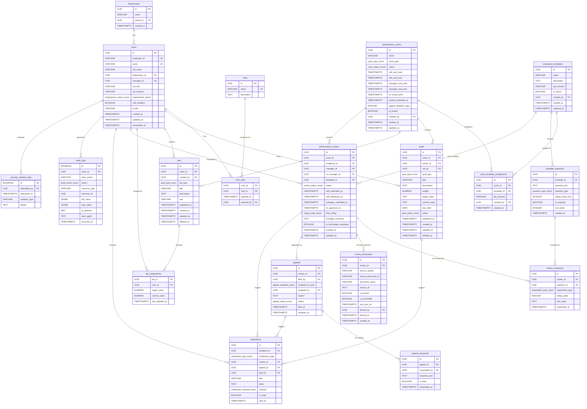

# Database Schema
## Table of Contents

- [Overview](#overview)
- [Entity Relationship Summary](#entity-relationship-summary)
- [Tables](#tables)
  - [users](#users)
  - [roles](#roles)
  - [user\_roles](#user_roles)
  - [departments](#departments)
  - [performance\_cycles](#performance_cycles)
  - [evaluation\_templates](#evaluation_templates)
  - [template\_questions](#template_questions)
  - [cycle\_template\_assignments](#cycle_template_assignments)
  - [goals](#goals)
  - [kpis](#kpis)
  - [kpi\_assignments](#kpi_assignments)
  - [performance\_reviews](#performance_reviews)
  - [review\_responses](#review_responses)
  - [review\_documents](#review_documents)
  - [appeals](#appeals)
  - [appeal\_responses](#appeal_responses)
  - [notifications](#notifications)
  - [audit\_logs](#audit_logs)
  - [security\_violation\_logs](#security_violation_logs)
- [Enums](#enums)
- [Indexes](#indexes)
- [Design Notes](#design-notes)

---

## Overview

This schema supports a centralized, enterprise-grade Performance Management System serving three primary actor types — **Employees**, **Managers**, and **HR Professionals** — across a global organization of ~100,000 employees.

Core functional domains:

| Domain | Description |
|---|---|
| **Identity & Access** | Users, roles, RBAC enforcement |
| **Goal Management** | SMART goals, KPIs, individual and team targets |
| **Performance Review** | Cycles, templates, self-evaluation, manager evaluation |
| **Appeal Handling** | Employee appeals, manager/HR responses |
| **Compliance & Audit** | Immutable audit logs, operation history |
| **Notifications** | System-triggered alerts across email and messaging |

---

## Entity Relationship Summary



---

## Tables

---

### `users`

Stores all system users regardless of role. Role assignment is managed via [`user_roles`](#user_roles).

| Column | Type | Constraints | Description |
|---|---|---|---|
| `id` | `UUID` | `PK, NOT NULL, DEFAULT gen_random_uuid()` | Primary key |
| `employee_id` | `VARCHAR(64)` | `UNIQUE, NOT NULL` | Company-issued employee ID |
| `email` | `VARCHAR(255)` | `UNIQUE, NOT NULL` | Corporate email address |
| `full_name` | `VARCHAR(255)` | `NOT NULL` | Display name |
| `department_id` | `UUID` | `FK → departments.id, NOT NULL` | Assigned department |
| `manager_id` | `UUID` | `FK → users.id, NULLABLE` | Direct manager; NULL if top-level |
| `job_title` | `VARCHAR(128)` | `NOT NULL` | Used to match evaluation template |
| `job_function` | `VARCHAR(64)` | `NOT NULL` | e.g. `engineering`, `sales`, `hr` |
| `employment_status` | `employment_status_enum` | `NOT NULL, DEFAULT 'active'` | See [Enums](#enums) |
| `mfa_enabled` | `BOOLEAN` | `NOT NULL, DEFAULT false` | Whether MFA is active |
| `locale` | `VARCHAR(10)` | `NOT NULL, DEFAULT 'zh-TW'` | UI language preference (BCP 47) |
| `created_at` | `TIMESTAMPTZ` | `NOT NULL, DEFAULT now()` | Record creation timestamp |
| `updated_at` | `TIMESTAMPTZ` | `NOT NULL, DEFAULT now()` | Last update timestamp |
| `terminated_at` | `TIMESTAMPTZ` | `NULLABLE` | Set on employee termination |

---

### `roles`

System-defined roles for RBAC.

| Column | Type | Constraints | Description |
|---|---|---|---|
| `id` | `UUID` | `PK, NOT NULL, DEFAULT gen_random_uuid()` | Primary key |
| `name` | `VARCHAR(64)` | `UNIQUE, NOT NULL` | e.g. `employee`, `manager`, `hr`, `admin` |
| `description` | `TEXT` | `NULLABLE` | Human-readable role description |

**Seed data:**

| name | description |
|---|---|
| `employee` | Standard employee; can self-evaluate, view own KPIs, file appeals |
| `manager` | Can set goals/KPIs, evaluate direct reports, import documents |
| `hr` | Manages cycles, templates, tracks completion, reviews audit logs |
| `admin` | System administrator; no access to performance data |

---

### `user_roles`

Many-to-many join between users and roles. A user can hold multiple roles (e.g., an employee who is also a team lead).

| Column | Type | Constraints | Description |
|---|---|---|---|
| `user_id` | `UUID` | `FK → users.id, NOT NULL` | |
| `role_id` | `UUID` | `FK → roles.id, NOT NULL` | |
| `granted_at` | `TIMESTAMPTZ` | `NOT NULL, DEFAULT now()` | When this role was granted |
| `granted_by` | `UUID` | `FK → users.id, NOT NULL` | Who granted this role |

**Primary Key:** `(user_id, role_id)`

---

### `departments`

Organizational unit hierarchy.

| Column | Type | Constraints | Description |
|---|---|---|---|
| `id` | `UUID` | `PK, NOT NULL, DEFAULT gen_random_uuid()` | Primary key |
| `name` | `VARCHAR(128)` | `NOT NULL` | Department name |
| `parent_id` | `UUID` | `FK → departments.id, NULLABLE` | Parent department; NULL if root |
| `created_at` | `TIMESTAMPTZ` | `NOT NULL, DEFAULT now()` | |

---

### `performance_cycles`

Defines a performance review period (annual, quarterly, probation, etc.).

| Column | Type | Constraints | Description |
|---|---|---|---|
| `id` | `UUID` | `PK, NOT NULL, DEFAULT gen_random_uuid()` | Primary key |
| `name` | `VARCHAR(128)` | `NOT NULL` | e.g. `2025 Q4 Quarterly Review` |
| `cycle_type` | `cycle_type_enum` | `NOT NULL` | See [Enums](#enums) |
| `status` | `cycle_status_enum` | `NOT NULL, DEFAULT 'draft'` | See [Enums](#enums) |
| `self_eval_start` | `TIMESTAMPTZ` | `NOT NULL` | Employee self-evaluation window opens |
| `self_eval_end` | `TIMESTAMPTZ` | `NOT NULL` | Employee self-evaluation window closes |
| `manager_eval_start` | `TIMESTAMPTZ` | `NOT NULL` | Manager evaluation window opens |
| `manager_eval_end` | `TIMESTAMPTZ` | `NOT NULL` | Manager evaluation window closes |
| `hr_review_end` | `TIMESTAMPTZ` | `NOT NULL` | HR review deadline |
| `results_published_at` | `TIMESTAMPTZ` | `NULLABLE` | When results become visible to employees |
| `appeal_deadline_days` | `INTEGER` | `NOT NULL, DEFAULT 7` | Days after publish that appeals are accepted |
| `is_locked` | `BOOLEAN` | `NOT NULL, DEFAULT false` | If true, goals/KPIs cannot be edited |
| `created_by` | `UUID` | `FK → users.id, NOT NULL` | HR who created the cycle |
| `created_at` | `TIMESTAMPTZ` | `NOT NULL, DEFAULT now()` | |
| `updated_at` | `TIMESTAMPTZ` | `NOT NULL, DEFAULT now()` | |

---

### `evaluation_templates`

Custom evaluation questionnaires that can be scoped to specific job functions.

| Column | Type | Constraints | Description |
|---|---|---|---|
| `id` | `UUID` | `PK, NOT NULL, DEFAULT gen_random_uuid()` | Primary key |
| `name` | `VARCHAR(128)` | `NOT NULL` | e.g. `Engineering Technical Assessment` |
| `description` | `TEXT` | `NULLABLE` | Template description shown in preview |
| `job_function` | `VARCHAR(64)` | `NULLABLE` | If set, template is scoped to this function |
| `is_active` | `BOOLEAN` | `NOT NULL, DEFAULT true` | Soft-delete flag |
| `created_by` | `UUID` | `FK → users.id, NOT NULL` | HR who created the template |
| `created_at` | `TIMESTAMPTZ` | `NOT NULL, DEFAULT now()` | |
| `updated_at` | `TIMESTAMPTZ` | `NOT NULL, DEFAULT now()` | |

> **Constraint:** A template cannot be deleted if it is referenced by any active [`cycle_template_assignments`](#cycle_template_assignments). The application layer enforces this and surfaces the count of blocking cycles to the HR user.

---

### `template_questions`

Individual questions within an evaluation template.

| Column | Type | Constraints | Description |
|---|---|---|---|
| `id` | `UUID` | `PK, NOT NULL, DEFAULT gen_random_uuid()` | Primary key |
| `template_id` | `UUID` | `FK → evaluation_templates.id, NOT NULL` | Parent template |
| `question_text` | `TEXT` | `NOT NULL` | Question shown to evaluator |
| `question_type` | `question_type_enum` | `NOT NULL` | See [Enums](#enums) |
| `rating_scale_max` | `INTEGER` | `NULLABLE` | For `rating` type; e.g. 5 |
| `is_required` | `BOOLEAN` | `NOT NULL, DEFAULT true` | Whether an answer is mandatory |
| `sort_order` | `INTEGER` | `NOT NULL, DEFAULT 0` | Display order within template |
| `created_at` | `TIMESTAMPTZ` | `NOT NULL, DEFAULT now()` | |

---

### `cycle_template_assignments`

Maps which evaluation template applies to which employee group within a cycle.

| Column | Type | Constraints | Description |
|---|---|---|---|
| `id` | `UUID` | `PK, NOT NULL, DEFAULT gen_random_uuid()` | Primary key |
| `cycle_id` | `UUID` | `FK → performance_cycles.id, NOT NULL` | |
| `template_id` | `UUID` | `FK → evaluation_templates.id, NOT NULL` | |
| `job_function` | `VARCHAR(64)` | `NOT NULL` | Which job function this mapping applies to |
| `created_by` | `UUID` | `FK → users.id, NOT NULL` | |
| `created_at` | `TIMESTAMPTZ` | `NOT NULL, DEFAULT now()` | |

**Unique Constraint:** `(cycle_id, job_function)` — one template per job function per cycle.

---

### `goals`

Individual or team goals set by managers for employees.

| Column | Type | Constraints | Description |
|---|---|---|---|
| `id` | `UUID` | `PK, NOT NULL, DEFAULT gen_random_uuid()` | Primary key |
| `cycle_id` | `UUID` | `FK → performance_cycles.id, NOT NULL` | The cycle this goal belongs to |
| `owner_id` | `UUID` | `FK → users.id, NOT NULL` | The employee (or team lead) who owns this goal |
| `set_by` | `UUID` | `FK → users.id, NOT NULL` | Manager who set the goal |
| `goal_type` | `goal_type_enum` | `NOT NULL` | `individual` or `team` |
| `title` | `VARCHAR(255)` | `NOT NULL` | Short title |
| `description` | `TEXT` | `NULLABLE` | Full SMART goal description |
| `weight` | `NUMERIC(5,2)` | `NULLABLE` | Relative weight for scoring; must sum to 100 per employee per cycle at app layer |
| `target_value` | `TEXT` | `NULLABLE` | Quantified target (stored as text to support varied formats) |
| `current_value` | `TEXT` | `NULLABLE` | Latest progress update |
| `due_date` | `DATE` | `NULLABLE` | SMART time-bound component |
| `status` | `goal_status_enum` | `NOT NULL, DEFAULT 'active'` | See [Enums](#enums) |
| `published_at` | `TIMESTAMPTZ` | `NULLABLE` | When manager officially published this goal |
| `created_at` | `TIMESTAMPTZ` | `NOT NULL, DEFAULT now()` | |
| `updated_at` | `TIMESTAMPTZ` | `NOT NULL, DEFAULT now()` | |
| `deleted_at` | `TIMESTAMPTZ` | `NULLABLE` | Soft delete timestamp |

> **Lock rule:** Goals may not be edited when `performance_cycles.is_locked = true`. Enforced at the application layer.

---

### `kpis`

KPI definitions owned by a manager for a specific cycle.

| Column | Type | Constraints | Description |
|---|---|---|---|
| `id` | `UUID` | `PK, NOT NULL, DEFAULT gen_random_uuid()` | Primary key |
| `cycle_id` | `UUID` | `FK → performance_cycles.id, NOT NULL` | |
| `created_by` | `UUID` | `FK → users.id, NOT NULL` | Manager who defined this KPI |
| `kpi_type` | `goal_type_enum` | `NOT NULL` | `individual` or `team` |
| `title` | `VARCHAR(255)` | `NOT NULL` | KPI name |
| `description` | `TEXT` | `NULLABLE` | Detailed description |
| `unit` | `VARCHAR(32)` | `NULLABLE` | Unit of measurement; e.g. `%`, `NTD`, `tickets` |
| `published_at` | `TIMESTAMPTZ` | `NULLABLE` | When KPI was officially published |
| `created_at` | `TIMESTAMPTZ` | `NOT NULL, DEFAULT now()` | |
| `updated_at` | `TIMESTAMPTZ` | `NOT NULL, DEFAULT now()` | |
| `deleted_at` | `TIMESTAMPTZ` | `NULLABLE` | Soft delete timestamp |

> **Constraint:** `published_at` may not be set if there are no assignments with target values. Enforced at the application layer with a user-facing validation error.

---

### `kpi_assignments`

Assigns a KPI to a specific employee or team member.

| Column | Type | Constraints | Description |
|---|---|---|---|
| `kpi_id` | `UUID` | `FK → kpis.id, NOT NULL` | |
| `user_id` | `UUID` | `FK → users.id, NOT NULL` | Assigned employee |
| `target_value` | `NUMERIC(15,4)` | `NOT NULL` | Individual numeric target |
| `current_value` | `NUMERIC(15,4)` | `NULLABLE` | Latest tracked value |
| `last_updated_at` | `TIMESTAMPTZ` | `NULLABLE` | When progress was last recorded |

**Primary Key:** `(kpi_id, user_id)`

---

### `performance_reviews`

One review record per employee per cycle. Tracks the full lifecycle: self-eval → manager eval → HR review.

| Column | Type | Constraints | Description |
|---|---|---|---|
| `id` | `UUID` | `PK, NOT NULL, DEFAULT gen_random_uuid()` | Primary key |
| `cycle_id` | `UUID` | `FK → performance_cycles.id, NOT NULL` | |
| `employee_id` | `UUID` | `FK → users.id, NOT NULL` | The employee being reviewed |
| `manager_id` | `UUID` | `FK → users.id, NOT NULL` | Assigned reviewing manager |
| `co_manager_id` | `UUID` | `FK → users.id, NULLABLE` | Secondary/previous manager for mid-cycle transfers |
| `template_id` | `UUID` | `FK → evaluation_templates.id, NOT NULL` | Template used for this review |
| `status` | `review_status_enum` | `NOT NULL, DEFAULT 'pending_self_eval'` | See [Enums](#enums) |
| `self_submitted_at` | `TIMESTAMPTZ` | `NULLABLE` | When employee submitted self-evaluation |
| `self_withdrawn_at` | `TIMESTAMPTZ` | `NULLABLE` | If employee withdrew and re-submitted; kept for audit |
| `manager_submitted_at` | `TIMESTAMPTZ` | `NULLABLE` | When manager completed evaluation |
| `hr_approved_at` | `TIMESTAMPTZ` | `NULLABLE` | When HR finalized the review |
| `final_rating` | `rating_scale_enum` | `NULLABLE` | See [Enums](#enums) |
| `manager_comment` | `TEXT` | `NULLABLE` | Overall manager narrative |
| `is_terminated_employee` | `BOOLEAN` | `NOT NULL, DEFAULT false` | Set true if employee left mid-cycle; excluded from completion stats |
| `created_at` | `TIMESTAMPTZ` | `NOT NULL, DEFAULT now()` | |
| `updated_at` | `TIMESTAMPTZ` | `NOT NULL, DEFAULT now()` | |

**Unique Constraint:** `(cycle_id, employee_id)`

---

### `review_responses`

Individual answers to template questions within a review. Stores both self-eval and manager responses.

| Column | Type | Constraints | Description |
|---|---|---|---|
| `id` | `UUID` | `PK, NOT NULL, DEFAULT gen_random_uuid()` | Primary key |
| `review_id` | `UUID` | `FK → performance_reviews.id, NOT NULL` | |
| `question_id` | `UUID` | `FK → template_questions.id, NOT NULL` | |
| `respondent_type` | `respondent_type_enum` | `NOT NULL` | `self` or `manager` |
| `rating_value` | `INTEGER` | `NULLABLE` | For rating-type questions |
| `text_value` | `TEXT` | `NULLABLE` | For open-ended questions |
| `responded_at` | `TIMESTAMPTZ` | `NOT NULL, DEFAULT now()` | |

**Unique Constraint:** `(review_id, question_id, respondent_type)`

---

### `review_documents`

Documents imported from integrated office tools and pinned to a review by a manager.

| Column | Type | Constraints | Description |
|---|---|---|---|
| `id` | `UUID` | `PK, NOT NULL, DEFAULT gen_random_uuid()` | Primary key |
| `review_id` | `UUID` | `FK → performance_reviews.id, NOT NULL` | |
| `source_system` | `VARCHAR(64)` | `NOT NULL` | e.g. `google_drive`, `sharepoint`, `confluence` |
| `source_document_id` | `VARCHAR(255)` | `NOT NULL` | External document identifier |
| `document_name` | `VARCHAR(255)` | `NOT NULL` | Display name |
| `source_url` | `TEXT` | `NULLABLE` | Deep link to original document |
| `is_pinned` | `BOOLEAN` | `NOT NULL, DEFAULT false` | Whether manager has marked it as evidence |
| `is_accessible` | `BOOLEAN` | `NOT NULL, DEFAULT true` | Set false if source becomes unavailable |
| `last_sync_at` | `TIMESTAMPTZ` | `NOT NULL, DEFAULT now()` | Last time accessibility was verified |
| `pinned_by` | `UUID` | `FK → users.id, NULLABLE` | Manager who pinned this document |
| `pinned_at` | `TIMESTAMPTZ` | `NULLABLE` | |
| `created_at` | `TIMESTAMPTZ` | `NOT NULL, DEFAULT now()` | |

---

### `appeals`

Formal appeals filed by employees against a specific review.

| Column | Type | Constraints | Description |
|---|---|---|---|
| `id` | `UUID` | `PK, NOT NULL, DEFAULT gen_random_uuid()` | Primary key |
| `review_id` | `UUID` | `FK → performance_reviews.id, NOT NULL` | |
| `filed_by` | `UUID` | `FK → users.id, NOT NULL` | The employee filing the appeal |
| `assigned_to_type` | `appeal_assignee_enum` | `NOT NULL` | `senior_manager` or `hr` |
| `assigned_to` | `UUID` | `FK → users.id, NOT NULL` | The specific user handling this appeal |
| `reason` | `TEXT` | `NOT NULL` | Employee's stated reason for appeal |
| `status` | `appeal_status_enum` | `NOT NULL, DEFAULT 'submitted'` | See [Enums](#enums) |
| `filed_at` | `TIMESTAMPTZ` | `NOT NULL, DEFAULT now()` | |
| `resolved_at` | `TIMESTAMPTZ` | `NULLABLE` | |

> **Deadline enforcement:** Before creating a record, the application layer checks `performance_cycles.results_published_at + appeal_deadline_days` against `now()`. If expired, the operation is rejected and the button is disabled in the UI.

---

### `appeal_responses`

Official responses to an appeal, supporting threaded communication.

| Column | Type | Constraints | Description |
|---|---|---|---|
| `id` | `UUID` | `PK, NOT NULL, DEFAULT gen_random_uuid()` | Primary key |
| `appeal_id` | `UUID` | `FK → appeals.id, NOT NULL` | |
| `responded_by` | `UUID` | `FK → users.id, NOT NULL` | Manager or HR who responded |
| `response_text` | `TEXT` | `NOT NULL` | Content of the response |
| `is_final` | `BOOLEAN` | `NOT NULL, DEFAULT false` | If true, marks appeal as resolved |
| `responded_at` | `TIMESTAMPTZ` | `NOT NULL, DEFAULT now()` | |

---

### `notifications`

System-generated notifications sent to users.

| Column | Type | Constraints | Description |
|---|---|---|---|
| `id` | `UUID` | `PK, NOT NULL, DEFAULT gen_random_uuid()` | Primary key |
| `recipient_id` | `UUID` | `FK → users.id, NOT NULL` | Target user |
| `notification_type` | `notification_type_enum` | `NOT NULL` | See [Enums](#enums) |
| `review_id` | `UUID` | `FK → performance_reviews.id, NULLABLE` | Related review |
| `appeal_id` | `UUID` | `FK → appeals.id, NULLABLE` | Related appeal |
| `goal_id` | `UUID` | `FK → goals.id, NULLABLE` | Related goal |
| `title` | `VARCHAR(255)` | `NOT NULL` | Short notification title |
| `body` | `TEXT` | `NOT NULL` | Full notification message |
| `channel` | `notification_channel_enum` | `NOT NULL` | `email`, `push`, `in_app` |
| `is_read` | `BOOLEAN` | `NOT NULL, DEFAULT false` | |
| `sent_at` | `TIMESTAMPTZ` | `NOT NULL, DEFAULT now()` | When notification was dispatched |

---

### `audit_logs`

**Immutable** record of every meaningful operation in the system. No row in this table may ever be updated or deleted, including by system administrators.

| Column | Type | Constraints | Description |
|---|---|---|---|
| `id` | `BIGSERIAL` | `PK, NOT NULL` | Sequential integer for ordering guarantees |
| `actor_id` | `UUID` | `FK → users.id, NULLABLE` | User who performed the action; NULL for system events |
| `actor_email` | `VARCHAR(255)` | `NOT NULL` | Snapshot of email at time of action (preserved after termination) |
| `action` | `audit_action_enum` | `NOT NULL` | See [Enums](#enums) |
| `resource_type` | `VARCHAR(64)` | `NOT NULL` | Table/entity name; e.g. `performance_reviews` |
| `resource_id` | `UUID` | `NOT NULL` | PK of the affected record |
| `old_value` | `JSONB` | `NULLABLE` | Previous state of changed fields |
| `new_value` | `JSONB` | `NULLABLE` | New state of changed fields |
| `ip_address` | `INET` | `NULLABLE` | Client IP at time of request |
| `user_agent` | `TEXT` | `NULLABLE` | Client user agent |
| `occurred_at` | `TIMESTAMPTZ` | `NOT NULL, DEFAULT now()` | Precise timestamp of action |

> **Immutability policy:** `UPDATE` and `DELETE` statements are prohibited via row-level security policy and database trigger. Any attempt is rejected and forwarded to [`security_violation_logs`](#security_violation_logs).

---

### `security_violation_logs`

Captures attempted tampering with audit records or other unauthorized operations.

| Column | Type | Constraints | Description |
|---|---|---|---|
| `id` | `BIGSERIAL` | `PK, NOT NULL` | |
| `attempted_by` | `UUID` | `NULLABLE` | User who attempted the violation |
| `attempted_at` | `TIMESTAMPTZ` | `NOT NULL, DEFAULT now()` | |
| `violation_type` | `VARCHAR(128)` | `NOT NULL` | e.g. `audit_log_delete_attempt` |
| `details` | `TEXT` | `NULLABLE` | Context about the violation |

---

## Enums

```sql
CREATE TYPE rating_scale_enum AS ENUM (
  'outstanding',
  'exceeds_expectations',
  'meets_expectations',
  'needs_improvement',
  'unacceptable'
);

CREATE TYPE employment_status_enum AS ENUM (
  'active',
  'on_leave',
  'terminated'
);

CREATE TYPE cycle_type_enum AS ENUM (
  'annual',
  'quarterly',
  'probation'
);

CREATE TYPE cycle_status_enum AS ENUM (
  'draft',
  'active',
  'locked',           -- is_locked = true; goals/KPIs frozen
  'results_published',
  'completed'
);

CREATE TYPE goal_type_enum AS ENUM (
  'individual',
  'team'
);

CREATE TYPE goal_status_enum AS ENUM (
  'active',
  'completed',
  'cancelled'
);

CREATE TYPE review_status_enum AS ENUM (
  'pending_self_eval',
  'self_eval_in_progress',
  'pending_manager_eval',
  'manager_eval_in_progress',
  'pending_hr_review',
  'completed',
  'terminated'         -- employee left mid-cycle
);

CREATE TYPE respondent_type_enum AS ENUM (
  'self',
  'manager'
);

CREATE TYPE question_type_enum AS ENUM (
  'rating',
  'text',
  'boolean'
);

CREATE TYPE appeal_assignee_enum AS ENUM (
  'senior_manager',
  'hr'
);

CREATE TYPE appeal_status_enum AS ENUM (
  'submitted',
  'under_review',
  'resolved'
);

CREATE TYPE notification_type_enum AS ENUM (
  'goal_published',
  'kpi_published',
  'goal_updated',
  'self_eval_reminder',
  'manager_eval_reminder',
  'results_published',
  'appeal_received',
  'appeal_responded',
  'appeal_resolved'
);

CREATE TYPE notification_channel_enum AS ENUM (
  'email',
  'push',
  'in_app'
);

CREATE TYPE audit_action_enum AS ENUM (
  'create',
  'read',           -- logged for sensitive data access
  'update',
  'delete',
  'publish',
  'withdraw',
  'submit',
  'approve',
  'appeal_filed',
  'appeal_responded'
);
```

---

## Indexes

```sql
-- users
CREATE INDEX idx_users_department_id        ON users(department_id);
CREATE INDEX idx_users_manager_id           ON users(manager_id);
CREATE INDEX idx_users_employment_status    ON users(employment_status);
CREATE INDEX idx_users_job_function         ON users(job_function);

-- performance_reviews
CREATE INDEX idx_reviews_cycle_id           ON performance_reviews(cycle_id);
CREATE INDEX idx_reviews_employee_id        ON performance_reviews(employee_id);
CREATE INDEX idx_reviews_manager_id         ON performance_reviews(manager_id);
CREATE INDEX idx_reviews_status             ON performance_reviews(status);

-- goals
CREATE INDEX idx_goals_cycle_id             ON goals(cycle_id);
CREATE INDEX idx_goals_owner_id             ON goals(owner_id);

-- kpi_assignments
CREATE INDEX idx_kpi_assignments_user_id    ON kpi_assignments(user_id);

-- appeals
CREATE INDEX idx_appeals_review_id         ON appeals(review_id);
CREATE INDEX idx_appeals_assigned_to       ON appeals(assigned_to);
CREATE INDEX idx_appeals_status            ON appeals(status);

-- notifications
CREATE INDEX idx_notifications_recipient_id ON notifications(recipient_id);
CREATE INDEX idx_notifications_is_read      ON notifications(is_read);

-- audit_logs
CREATE INDEX idx_audit_logs_actor_id        ON audit_logs(actor_id);
CREATE INDEX idx_audit_logs_resource        ON audit_logs(resource_type, resource_id);
CREATE INDEX idx_audit_logs_occurred_at     ON audit_logs(occurred_at DESC);
```

---

## Design Notes

### Immutable Audit Logs

`audit_logs` must be append-only. Enforce using PostgreSQL row-level security:

```sql
ALTER TABLE audit_logs ENABLE ROW LEVEL SECURITY;

CREATE POLICY audit_insert_only ON audit_logs
  FOR INSERT TO application_role WITH CHECK (true);

-- No UPDATE or DELETE policy is defined, blocking all such operations at the DB level.
```

Any violation attempt triggers a `BEFORE UPDATE OR DELETE` trigger that inserts into `security_violation_logs` and raises an exception.

### Soft Delete vs Hard Delete

No performance-related record is ever hard-deleted. Soft deletion is used:

- `users.terminated_at` — for employee termination
- `evaluation_templates.is_active = false` — for templates no longer in use
- `performance_reviews.is_terminated_employee = true` — excludes record from completion dashboards
- `goals.deleted_at` and `kpis.deleted_at` — for user-deleted objectives

### Cycle Locking

When `performance_cycles.is_locked = true`, the application layer rejects all `UPDATE` operations on `goals` and `kpis` referencing that cycle, returning a `423 Locked` HTTP status.

### Appeal Deadline Enforcement

Appeal eligibility is checked at application layer using:

```
results_published_at + INTERVAL '1 day' * appeal_deadline_days < now()
```

If the deadline has passed, the endpoint returns `403 Forbidden` and the UI disables the appeal button.

### Multi-language Support

User-facing content (template questions, notification bodies, goal titles) should be stored in the default language and translated at the application layer using a separate i18n service. The `users.locale` field drives language selection.

### Encryption at Rest

All columns containing PII (emails, names, evaluation text) must be encrypted at rest using AES-256. Enforce via database-level transparent data encryption (TDE) or column-level encryption depending on infrastructure.